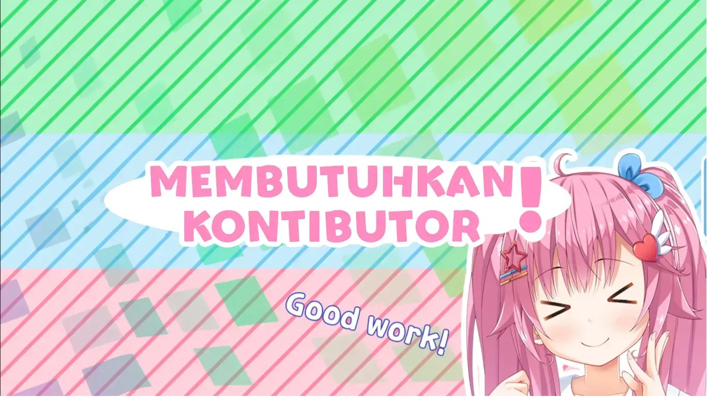

<h1 align="center">
  API Kamus Gen Z
</h1>

Yup sesuai dengan judulnya, Repositori merupakan API yang berisikan koleksi bahasa gaul Gen Z beserta artinya. Dari "santuy" sampai "mager", semua ada disini.  Gampang diintegrasi dan ~~berbayar~~ open-source!

Project dibangun diatas Tech Stack
- [Node.js](https://nodejs.org/)
- [Express.js](https://expressjs.com/)
- [Prisma.js](https://www.prisma.io/)

Tech Stack-nya keren bukan?!

---

<h1 align="center">
  Dicari Kontributor!!
</h1>

Bosen ngoding sendirian? Gabung sini! Kita rame-rame bikin project ini makin mantap. Diskusi dan kontribusi ditunggu banget!

## Bagaimana caranya?

Untuk member organization IMPHNEN
1. Clone repository ini
2. Buat branch baru dengan nama user
3. Commit dan push
4. Buat pull request

Untuk non member organization IMPHNEN
1. Fork repository
2. Clone repository
3. Commit dan push
4. Buat pull request

## Getting Started
Bebas mau pake npm, yarn, pnpm (tutor pake yarn)

```bash
# install package, dll.
yarn install

# windows
copy .env.example .env
# linux/mac
cp .env.example .env

# migrasi database
npx prisma migrate dev --name init
# saran : kalian bisa menginstall ekstensi SQLite Viewer

# jalankan
yarn dev
```

Atau pake docker

```bash
# jalankan
docker compose up -d

# untuk mematikan
docker compose down
```

buka API Documentation
[http://localhost:3000/api-docs](http://localhost:3000/api-docs)

jika sudah bisa selanjutnya kalian bisa melakukan perubahan pada kode lalu mengikuti tutorial untuk member / non member


## Kontributor

Mereka yang dibawah ini telah menjadi kontributor di repositori ini. Ayo selanjutnya giliran kamu.

<a href="https://github.com/IMPHNEN/kamus-gen-z-api/graphs/contributors">
  
</a>
