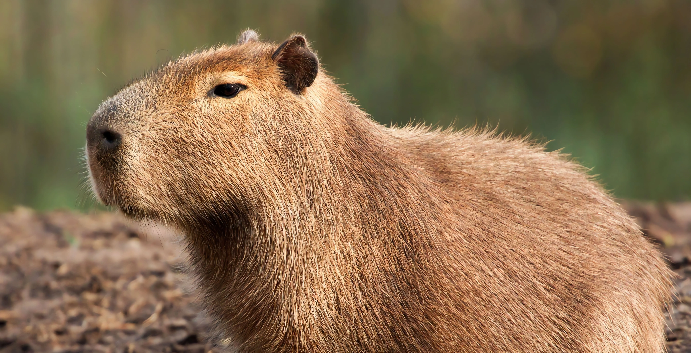

# API Kamus Gen Z

Koleksi bahasa gaul Gen Z beserta artinya.

Project dibangun diatas tech stack
- Node.js
- Express.js
- Prisma.js

*Sorry, gw skill issue nulis readme :D
## Kontribusi

**YUK KONTRIBUSI**

Untuk member orgs
1. Clone repository ini
2. Buat branch baru dengan nama user
3. Commit dan push
4. Buat pull request

Untuk non member orgs
1. Fork repository
2. Clone repository
3. Commit dan push
4. Buat pull request
